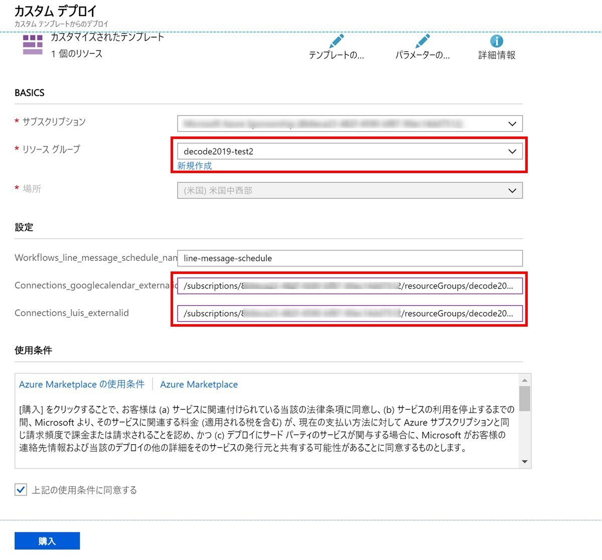

# サンプルのLogic Apps（jsonデータ）を利用する手順

sample01、sample02共に、LogicAppsをテンプレート化しているので、Azureポータル画面の「テンプレート」を利用して展開することもできます。 

## テンプレートの展開

sample01のLogic Appsテンプレートを例に手順をご紹介します。 
sample02のLogic Appsテンプレートを展開する場合は適宜内容を変更してください。

[Azureポータル画面](https://portal.azure.com/) の左メニューから「すべてのサービス」をクリック。

テンプレートをクリック。

赤枠内の「追加」をクリック。

「全般」の名前、説明を入力し、OKボタンをクリックします。 

「ARMテンプレート」にLogic Appsのテンプレート（sample01-template.json）の内容を全てコピペし、OKをクリックします。 
「追加」ボタンをクリック。

上部の「更新」ボタンをクリックすると、全般で設定した名前が表示されるのでクリック後、「展開」をクリック。

「テンプレートの編集」をクリック。

以下の文言の部分を適切な情報に置き換えてください。

- ご自身のサブスクリプションIDに変更（10行目14行目付近、396行目401行目付近）
- LUISのAPI Key（231行目付近。LUISポータルサイトに表示）
- Bearer情報が入ります（258行目付近。LINE側に表示あり）
- メールアドレス（286行目付近。Gmailのメールアドレス）

以上の内容の変更が終わったら下方の「保存」をクリック。

テンプレートを展開したいリソースグループを選びます。（新規作成でも可） 
「ご自身のサブスクリプションIDに変更」の表記部分も変更します。 
一番下の「上記の使用条件に同意する」にチェックを入れるのを忘れずに。 
全て入力したら「購入」をクリック。

展開が成功すると、このようにLogic Appsが作成されます。

## 「接続が無効です」の表示になっているコネクタ

「新規追加」ボタンをクリックし、再度接続しなおしてください。