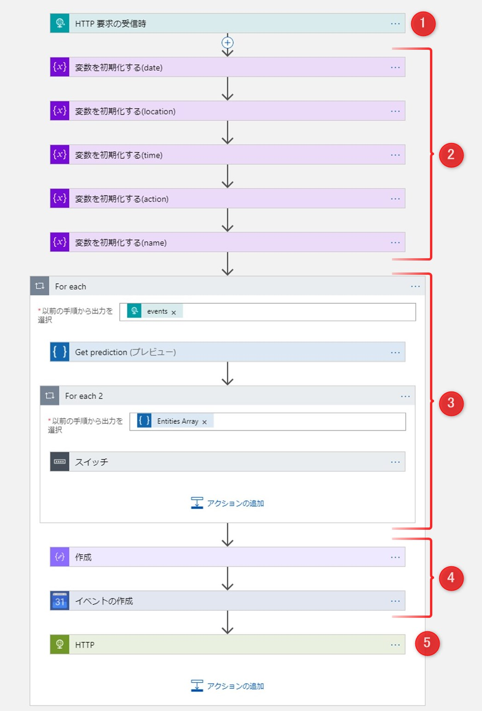

# [Sample01] LINEメッセージ（テキスト）で送信するスケジュール内容をGoogleカレンダーに自動入力するChat Bot

LINEで送信するスケジュール内容（テキスト）をLogic Apps、Cognitive ServicesのLanguage Understanding（LUIS）を利用してGoogleカレンダーに自動入力します。

## 作成手順

今回の仕組みを作成する手順は以下です。

1. LINE Messaging APIの登録
2. Language Understanding（LUIS）の作成
3. Azure Logic Appsの作成

## 1. LINE Messaging APIの登録

「LINE Messaging API」を利用するには登録が必要です。 
利用方法はLINE公式サイトの「[Messaging APIを利用するには](https://developers.line.biz/ja/docs/messaging-api/getting-started/)」を参照してください。

## 2. Language Understanding（LUIS）の作成

LUISの詳細と登録に関しては以下の寄稿記事を参照ください。  
[[ascii.jp]自分用メモ的にLINE送信した予定をAIで読み取ってGoogleカレンダーに自動登録しよう](https://ascii.jp/elem/000/001/770/1770731/)

## 3. Azure Logic Appsの作成

ワークフローの全体図。

## 3-1. トリガーの作成（HTTP 要求の受信時）

トリガーには「HTTP 要求の受信時」を選択します。 

2には「line-messaging-api.json」の内容をコピペし「保存」をクリックします。1に表示されるURLはLINE側のWebhook送信の設定に利用します。

## 3-2. 変数コネクタを初期化

LUISの結果のEntitesを「動的コネクタ」として後続のアクションで使いやすくするため、変数コネクタを利用します。 
「名前」には、LUISで登録した5つのEntites（date、time、name、location、action）を入れ、5つの変数コネクタを作成します。コネクタ名は、わかりやすくするため適宜変更してください。 
「種類」は5つとも「文字列」を選択します。

## 3-3-1. LUISコネクタ

「制御」の中からFor eachコネクタを選択し、動的コンテンツは「events」を選択します。

次に「LUIS」と検索し、LUISコネクタの「Get prediction」を選択します。

「接続名」にはわかりやすい名前を入力します。（LUIS側のMy Appsと合わせるとわかりやすいです） 
「API Key」に入力する情報は [LUISサイト](https://LUIS.ai) の以下の場所にあります。

1. 上部メニュー「MANAGE」をクリック
2. 「Keys and Endpoints」ページ内の「Authoring Key」をコネクタの「API Key」に入力

接続が出来ると図のような表記に変わります。 

1. App Id：利用するLUISの「My Apps」の名前を選択
2. 一旦「aaaaa」などダミーの文言を入力
3. 「Desired Intents」にチェックを入れ、表示される「Intents」を入力（今回は「Plans」）

ここまで入力できたら、上部の「保存」をクリックして一度保存します。 
その後、左メニューの「開発ツール：ロジック　アプリ　コードビュー」をクリックし、表示をデザイナーからコードビューに変更します。

コードビューで図の表記の部分を探します。（大体27行目前後)

図の内容に変更し、上部の「保存」をクリックして保存し「ロジック　アプリ　デザイナー」をクリックします。

デザイナー画面が表示されたとき、図の表記になっていれば問題ありません。

## 3-3-2. 結果の「Entities」を変数コネクタに設定する

LUISの結果はJSONで出力されます。 
この結果を「date：○月○日」、「time：14:00」という形で後続の処理で利用できるようにします。「アクションの追加」をクリック後、「制御」と入れて検索し「For each」をクリックします。

「以前の手順から出力を選択」には、「動的なコンテンツ」一覧から「Entites Array」を選択します。

1. 右端の「・・・」をクリックしメニューを表示させます
2. 「設定」をクリック

Logic Appsの「For each」はデフォルト設定が並列処理数は20アクションになっています。 このあとの処理は「1アクションずつEntitiesを変数コネクタに設定したい」ので、順次処理になるよう変更する必要があります。図を参考に、「規定値のオーバーライド：オン」、「並列処理の次数：1」に変更、完了をクリックします。

検索窓に「制御」と入れて検索し「スイッチ」をクリックします。 

制御構文の「スイッチ（条件多分岐）」を利用して、「変数の初期化」で作成した変数に値を入れていきます。例として、Entites「date（日付）」を変数に設定してみます。

1. 動的なコンテンツの「Entities Array Entity Type」を選択
2. Entites「date」と入力
3. 「変数」コネクタの中から「変数を設定」をクリック。名前に「date」と入力
4. 動的なコンテンツの「Entities Array Entity Value」を選択
5. 「ケース」を増やす場合クリックします

この方法で、初期化した5つの変数（date、time、name、location、action）のケースを作成します。（2と3の部分をそれぞれの名前で変更） 
なお、デフォルトで作成されている「既定」には何も入力しません。

## 4. Googleカレンダーに登録

検索窓に「データ操作」と入れて検索し「作成」をクリックします。 
LUISで解析した「date」をカレンダー登録に利用できる日付形式に変換する必要があります。今回はLogic Apps の「式」で利用できる「formatDateTime」を使って文字列を日付形式にします。 

1. フォーム内でクリックして右のメニューを表示させる
2. 「式」をクリック
3. 日時タイトルの右にある「もっと見る」をクリックすると表示される「formatDateTime」をクリック
4. 「date」と入力、更新をクリック

この処理を行うことで「○/○」や「○月○日」が「2019-00-00T00:00:00.0000000」という表記に変わり、Googleスケジュールで利用できる形になります。

1. カレンダーID：複数ある場合はスケジュールを入力したいものを選択
2. 開始（終了）時刻：動的なコンテンツの「作成」＞出力を選択。Googleカレンダー入力はこの部分に工夫が必要で「タイムゾーンの設定」が必須になります。今回は「2019-00-00T00:00:00.0000000」にタイムゾーンを表す「+9:00」を直に入力して追記することで対処しました。
3. 説明：「スケジュールの内容（人名）」の表記になるよう、動的なコンテンツを選択
4. 場所：動的なコンテンツ「location」を選択
5. タイトル：「[時間]スケジュール内容（場所）」の表記になるよう、動的なコンテンツを選択

今回、時間は「00:00:00」で入力されます。
カレンダーに表示する項目は適宜変更してみてください。

最後に、「HTTP」コネクタを利用して、スケジュール登録が完了したら「スケジュール登録しました！」とメッセージを返信する処理を入れます。 
URI、ヘッダーの内容はLINE側で確認してください。 
「本文」には「HTTPコネクタ.json」の内容をコピペします。 

ascii.jpに詳細な手順を記載した記事を寄稿していますので、こちらも参考にされてください。

- [自分用メモ的にLINE送信した予定をAIで読み取ってGoogleカレンダーに自動登録しよう](https://ascii.jp/elem/000/001/770/1770731/)