# [Sample02] LINEボイスメッセージ（音声）で送信するスケジュール内容をGoogleカレンダーに自動入力するChat Bot

LINEで送信するスケジュール内容（ボイスメッセージ）をLogic Apps、Cognitive ServicesのSpeech to text、Language Understanding（LUIS）を利用してGoogleカレンダーに自動入力します。<br>

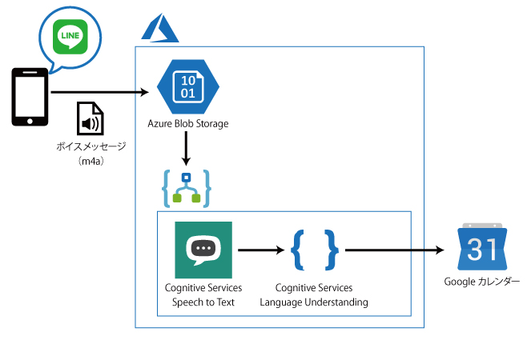

仕組みを作成する手順は以下です。<br>
**※今回の仕組みはFreeプランでは利用できないサービスが含まれます**

1. LINE Messaging APIの登録
2. Language Understanding（LUIS）の作成
3. Azure Blob Storageの準備
4. Speech Services(Speech to text)の準備
5. Azure Logic Appsの作成
    - 5-1. 「line-voiceschedule-storage」の作成
    - 5-2. 「line-voice-schedule」の作成

## 1. LINE Messaging APIの登録

「LINE Messaging API」を利用するには登録が必要です。<br>
利用方法はLINE公式サイトの「[Messaging APIを利用するには](https://developers.line.biz/ja/docs/messaging-api/getting-started/)」を参照してください。

## 2. Language Understanding（LUIS）の作成

LUISの詳細と登録に関しては以下の寄稿記事を参照ください。  
[[ascii.jp]自分用メモ的にLINE送信した予定をAIで読み取ってGoogleカレンダーに自動登録しよう](https://ascii.jp/elem/000/001/770/1770731/)

## 3. Azure Blob Storageの準備

[Azureの管理ポータル](https://portal.azure.com/) の左メニュー項目「＋リソースの作成」→「ストレージ」→「ストレージアカウント」をクリック。

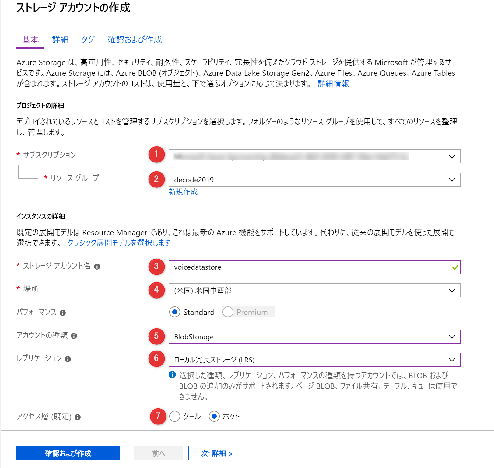

表示された「ストレージアカウントの作成」に、次の1～7の情報を入力します。

1. サブスクリプション：サブスクリプションが複数ある場合はBlobストレージを作成したい名前を選択
2. リソースグループ：「新規作成」をクリックし、わかりやすいリソースグループ名を入力（日本語の使用不可）
3. ストレージアカウント名：わかりやすい名前を入力します。名前は一意なので表示されているものとは違う名前を入力（日本語の使用不可）
4. 場所（リージョン）：今回は「米国中西部」を選択
5. アカウントの種類：今回は「BlobStorage」を選択
6. レプリケーション：今回は「ローカル冗長ストレージ（LRS）」を選択
7. アクセス層：「ホット」を選択

上記の入力が完了したら「確認および作成」ボタン→「作成」ボタンとクリック。<br>
デプロイが完了すると「デプロイが完了しました」というページが表示されるので「リソースに移動」ボタンをクリックします。

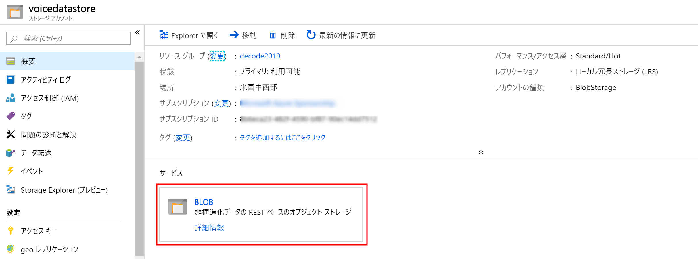

「概要」ページの「Blob」をクリックします。

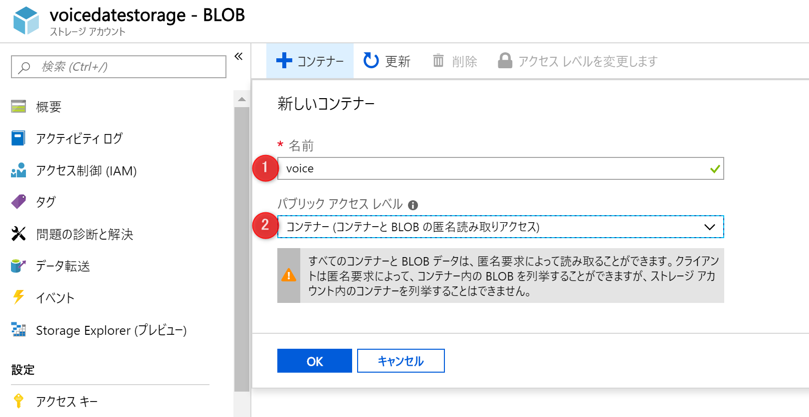

上部の「＋コンテナー」をクリックし、次の情報を入力します。

1. 名前：コンテナー名は小文字で入力します（日本語の使用不可）。
2. パブリック アクセス　レベル：「コンテナー（コンテナーとBLOBの匿名読み取りアクセス）」を選択。

入力が完了したら「OK」ボタンをクリックします。<br>
作成したコンテナーの右端の「・・・」をクリックし、「コンテナーのプロパティ」をクリックするとURLという項目があります。<br>
この情報はLogic Appsで利用するので、URLをコピーしておきます。

## 4. Speech Services(Speech to text)の準備

Azureの管理ポータルの左メニュー項目「＋リソースの作成」→検索窓に「Speech」と入力し、表示される「音声」の作成をクリック。

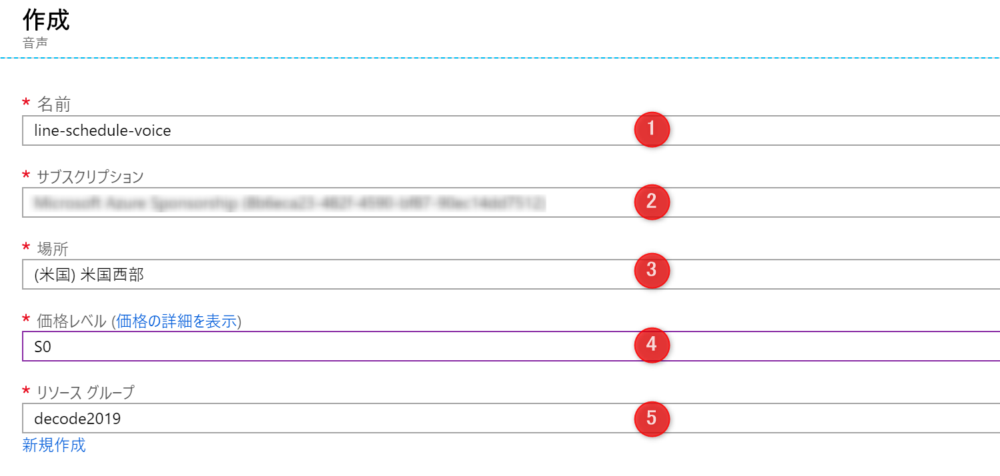

次の1～5の情報を入力します。

1. 名前：作成するSpeech to textの名前を入力（日本語の使用不可）
2. サブスクリプション：サブスクリプションが複数ある場合にのみ表示されるメニューです。複数ある場合、利用するサブスクリプション名を選択。
3. 場所（リージョン）：「米国西部」を選択
4. 価格レベル：「S0」を選択。 **※本仕組みは「F0（無料）」は利用できません**
5. リソースグループ：今回は「既存のものを使用」を選択。「Blob Storage」を作成しているリソースグループ名を選択します。

入力が完了したら「作成」ボタンをクリックします。
Logic Appsの設定で利用するので、左メニューの「キー」をクリックし、「KEY1」を控えておきます。

## 5. Azure Logic Appsの作成

今回のLogic Appsは2つ作成します。
- 5-1. line-voiceschedule-storage（LINEのボイスメッセージをBlob Storageに格納する）
- 5-2. line-voice-schedule（格納済みのボイスメッセージをSpeech to textサービスを利用して音声テキスト変換）

## 5-1. 「line-voiceschedule-storage」の作成

LINEのボイスメッセージをBlob Storageに格納するワークフローの全体図。


## 5-1-1. トリガーの作成（HTTP 要求の受信時）

トリガーには「HTTP 要求の受信時」を選択します。<br>

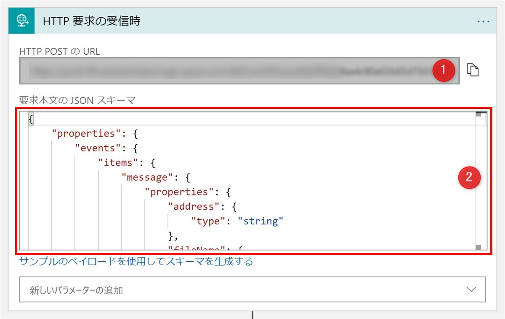

2には「line-messaging-api.json」の内容をコピペし「保存」をクリックします。1に表示されるURLはLINE側のWebhook送信の設定に利用します。

## 5-1-2. For eachとHTTPコネクタの設定

「制御」を検索し「For each」を選びます。<br>
「以前の手順から～」の部分には、動的なコンテンツの「events」を選択。その後、「HTTP」と検索しHTTPコネクタに以下の内容を入力していきます。

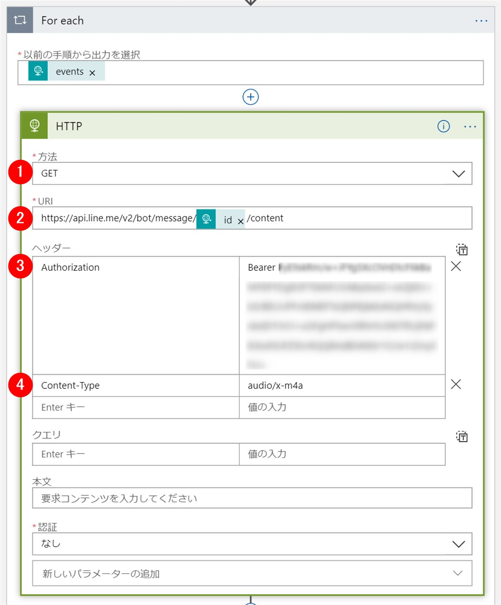

1. 方法：「GET」を選択
2. URI：以下の内容をコピペします。

```
https://api.line.me/v2/bot/message/[動的コンテンツidを選択する]/content
```

下記URIの表記のうち「動的コンテンツidを選択する」の文字を削除し、動的コンテンツの「id」に置き換えてください。

3. Authorization：「Bearer」の内容はLINE側で確認してください。
4. Content-Type：「audio/x-m4a」を入力します。

## 5-1-3. 「BLOBの作成」コネクタの設定

「BLOB」と検索し「BLOBの作成」を選択します。

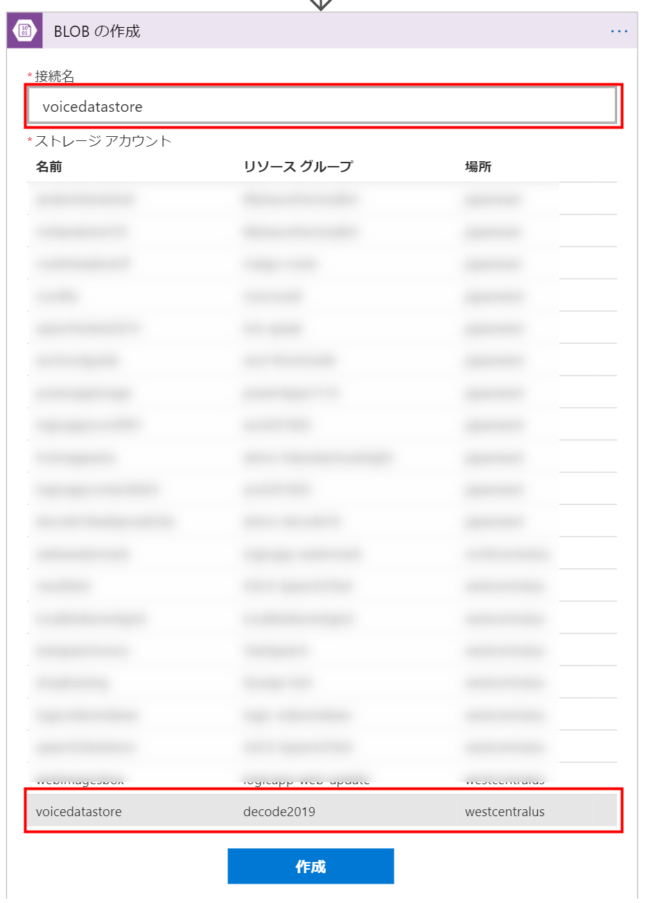

接続名はBlob Storageと同じ名前にしておくとわかりやすいと思います。

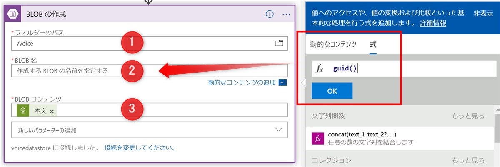

1. 「BLOB名」にカーソルがあるのを確認し、「式」をクリック。
2. 「guid()」と入力します。（グローバルに一意の文字列）
3. 「BLOBコンテンツ」部分は、動的コンテンツの「HTTP」の「本文」を選択（※動的コンテンツが表示されていない場合は「もっと見る」をクリックしてみてください）

## 5-2. 「line-voice-schedule」の作成

格納済みのボイスメッセージをSpeech to textサービスを利用して音声テキスト変換するワークフローの全体図。

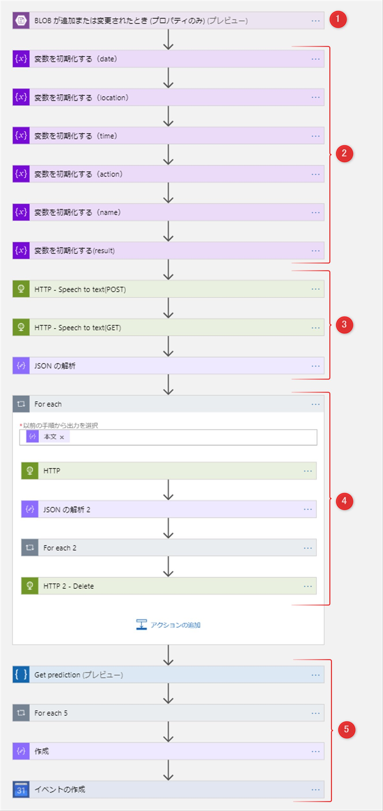

## 5-2-1. トリガーの作成（BLOBが追加または変更されたとき）

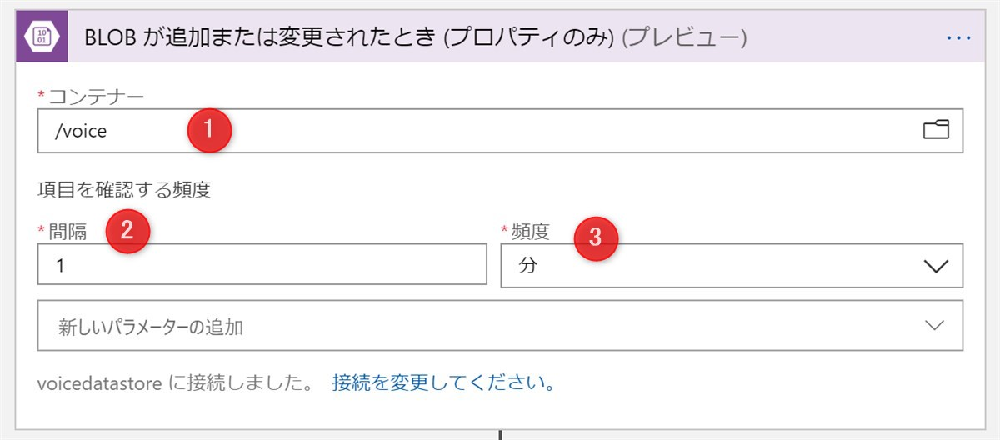

今回はトリガーに「BLOBが追加または変更されたとき」コネクタを使用します。先程作成したワークフローでBLOBにボイスメッセージが格納されると実行するワークフローです。

1. コンテナー：LINEの音声ファイルが格納されているBlobのコンテナーを指定
2. 間隔：頻度を決めます。ほぼリアルタイムにしたい場合は「1」で。
3. 頻度：今回は「分」を選択

項目中の「間隔」の部分ですが、このトリガーはポーリングトリガー（決められたスケジュールで実行）なので、時間を短く設定すると頻繁にトリガー部分の実行が起こり、**都度、費用がかかります**（BLOBにファイルが格納されていない場合はトリガーの起動のみ。以降のアクションは全てスキップ処理）。<br>
適宜変更するか、利用しないときは**ワークフローを無効化**してください。

## 5-2-2. 変数コネクタを初期化

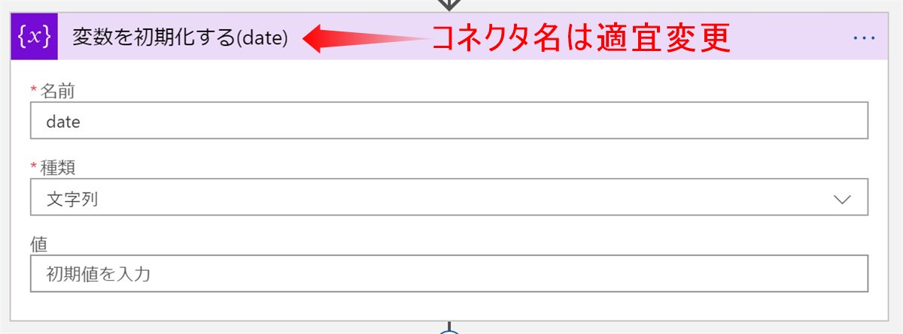

LUISの結果のEntitesを「動的コネクタ」として後続のアクションで使いやすくするため、変数コネクタを利用します。<br>
「名前」には、LUISで登録した5つのEntites（date、time、name、location、action）と、今回は「result」の6つの変数コネクタを作成します。コネクタ名は、わかりやすくするため適宜変更してください。<br>
「種類」は5つとも「文字列」を選択します。

## 5-2-3-1. HTTPコネクタの設定（POST）

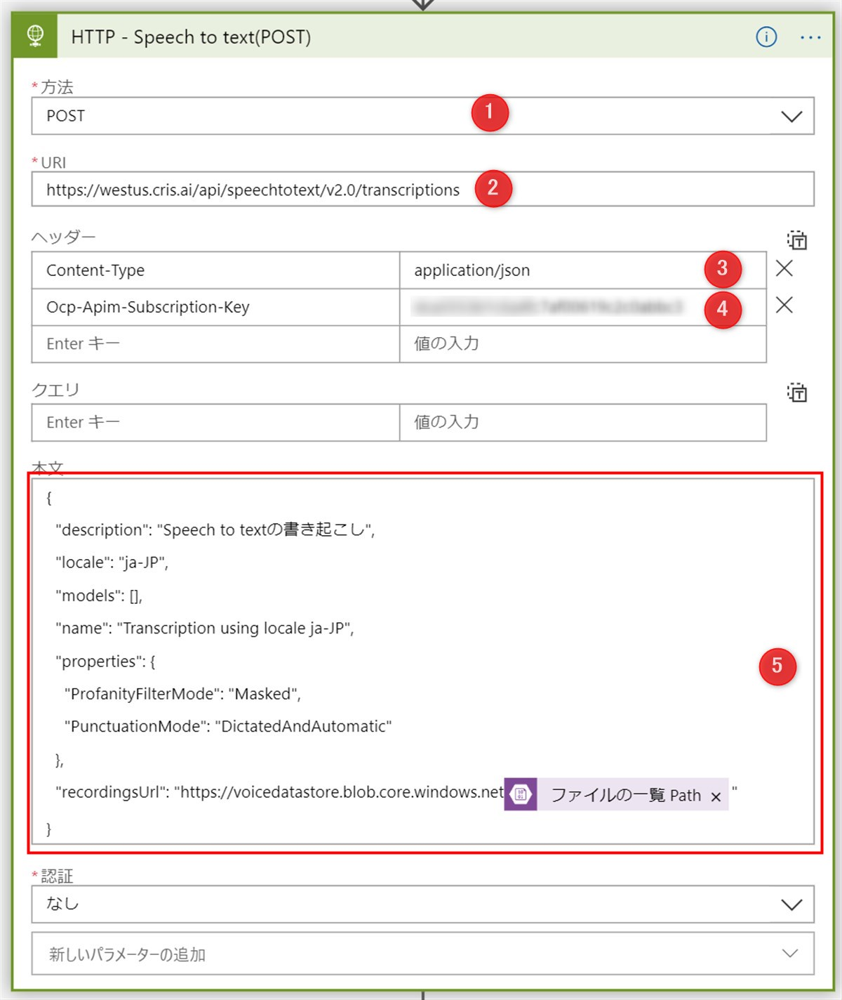

HTTPコネクタを選択します（便宜上、図中では名前を「HTTP - Speech to text(POST)と表記」）。

1. 方法：「POST」を選択
2. URI：以下の内容をコピペ

```
https://westus.cris.ai/api/speechtotext/v2.0/transcriptions 
```
3. Content-Type：「application/json」と入力します。
4. Ocp-Apim-Subscription-Key：作成したSpeech To textの「key」を入力
5. 本文：「HTTP-SpeechtoText.json」の内容をコピペし、「recordingsUrl」の内容を適宜変更

## 5-2-3-2. HTTPコネクタの設定（GET）

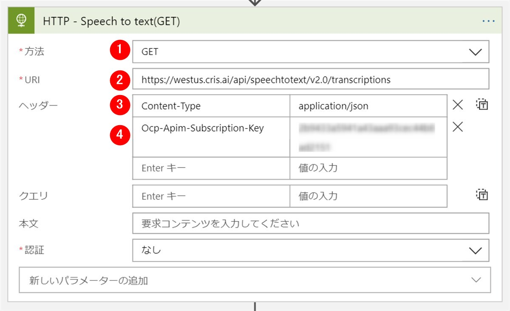

「HTTP」と検索し、HTTPコネクタを選択します（便宜上、図中では名前を「HTTP - Speech to text(GET)と表記」）

1. 方法：「GET」を選択
2. URI：以下の内容をコピペ

```
https://westus.cris.ai/api/speechtotext/v2.0/transcriptions
```

3. Content-Type：「application/json」と入力
4. Ocp-Apim-Subscription-Key：上記のHTTPコネクタ（POST）と同じ内容を入力

## 5-2-3-3. JSONの解析コネクタの設定

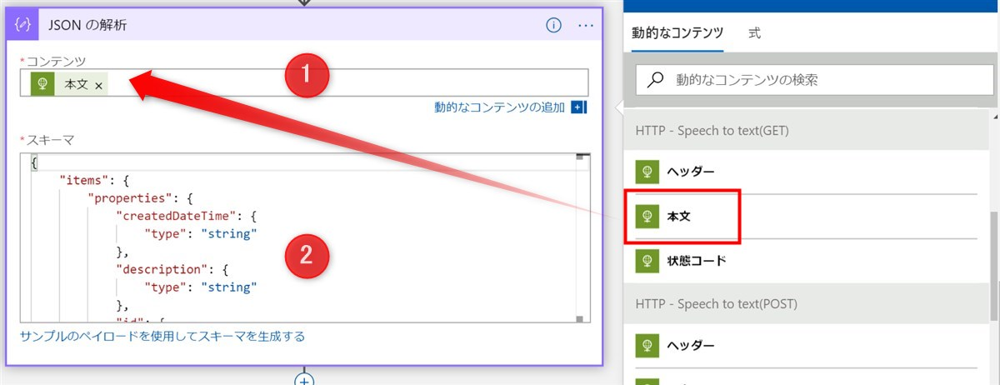

「データ操作」と検索し、「JSONの解析」をクリック。

1. コンテンツ：前の処理の「HTTP（GET）」、動的コンテンツの「本文」を選択
2. スキーマー：「JSONの解析01.json」の内容をコピペ

ここまででSpeech to text APIを利用し、ボイスメッセージをテキスト変換する処理を行っています。

## 5-2-4. For eachコネクタの設定

「制御」と検索し、For each コネクタを選択します。コネクタ名の右端の「・・・」をクリックし「設定」をクリック。

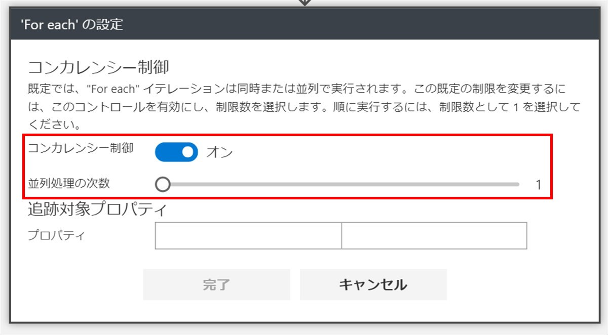

「コンカレンシー制御」をオンにして、並列処理の次数を「1」に設定後、完了ボタンをクリックします。この部分の設定ができていないと、うまく実行されないことがあるので注意！

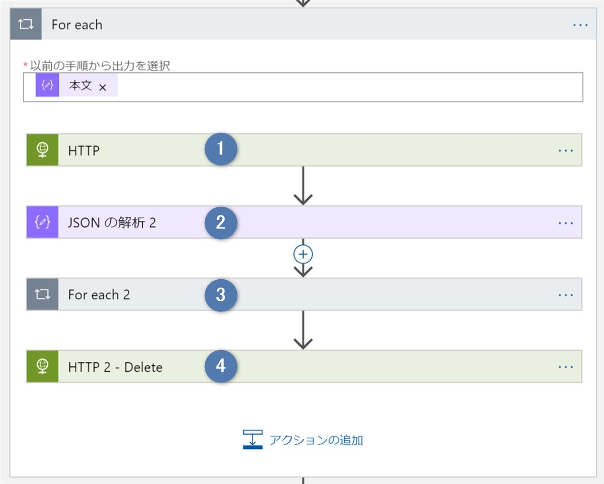

For eachコネクタの出力選択は、「JSONの解析」から動的コンテンツを「本文」を選択します。以降のコネクタ（1～4）は全て、このFor eachコネクタの中に入るようにします。

## 5-2-4-1. HTTPコネクタの設定

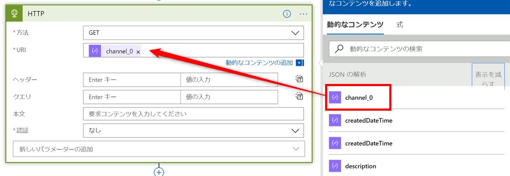

方法は「GET」を選択、URIは「JSONの解析」から動的コンテンツを「channel_0」を選択します。（もっと見る、をクリックすると表示されます）

## 5-2-4-2. JSONの解析コネクタの設定

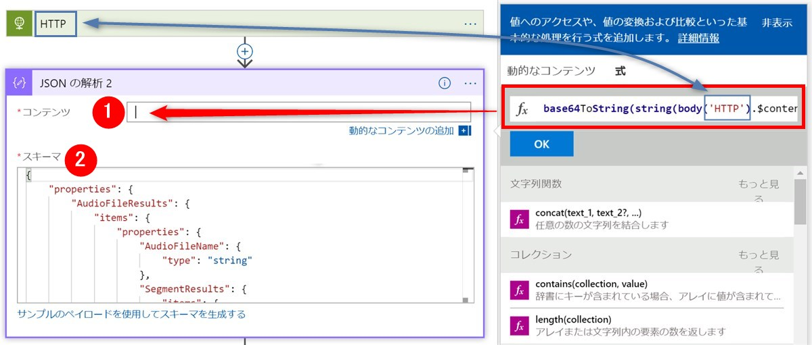

出力される結果はcontent-TypeがJSONではありません。このため、後続のアクションで結果を利用できません。<br>
Logic Appsで扱える形式になるように、**base64ToString変数**を使用してデータ変換します。

1. コンテンツ：変数を使用します。「式」を選択し、以下の内容をコピペします。図中の青の矢印になりますが、「HTTP」の部分は前の処理のHTTPコネクタの名前に合わせます。例えば「HTTP2」という表示になっていた場合は表記を変更してください

```
base64ToString(string(body('HTTP').$content)) 
```

2. 「JSONの解析02.json」の内容をコピペ

## 5-2-4-3. For each2の設定（音声テキスト変換結果を出力する部分）

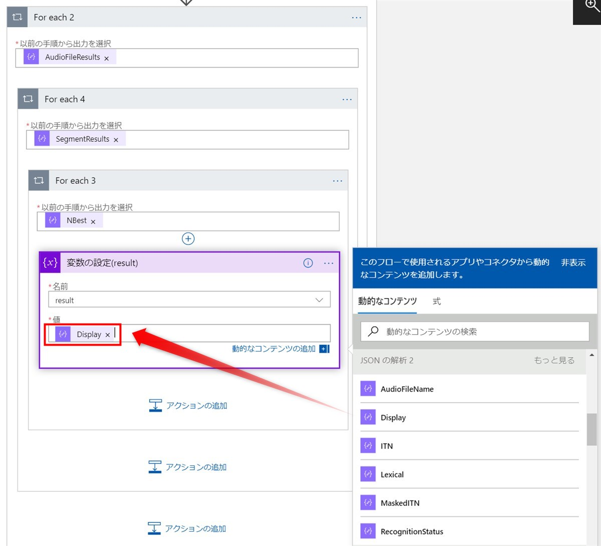

音声テキスト変換の結果は「NBest」の配列内に表示されていますが、「Display」のみを後続のアクションに利用できるようにします。<br>
For eachコネクタを利用して取り出しますが、設定方法は図を参考にしてください。「Display」を初めに初期化した変数「result」に出力します。

## 5-2-4-4. HTTPコネクタの設定（Delete）

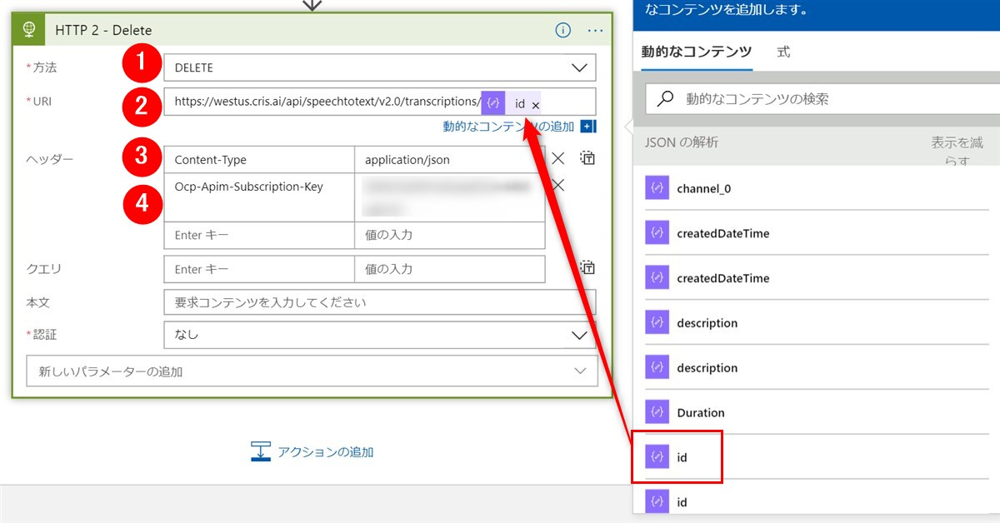

「Delete」処理用のHTTPコネクタを設定します。今回利用するAPIは実行すると結果が残る仕様のため、都度削除する必要があるためです。<br>
HTTPコネクタを選択します（便宜上、図中では名前を「HTTP2 - Deleteと表記」）。

1. 方法：「DELETE」を選択
2. URI：以下の内容をコピペします。下記入力後、最後の部分に動的コンテンツの「id」を追加

```
https://westus.cris.ai/api/speechtotext/v2.0/transcriptions/
```

3. ontent-Type：「application/json」と入力
4. Ocp-Apim-Subscription-Key：上記のHTTPコネクタで利用したものと同じ内容を入力

## 5-2-5. Googleカレンダーに登録

これまでの内容を利用して、Googleカレンダーに登録する部分です。<br>
内容はsample01の [README.md](sample01/readme.md) を参照してください。

